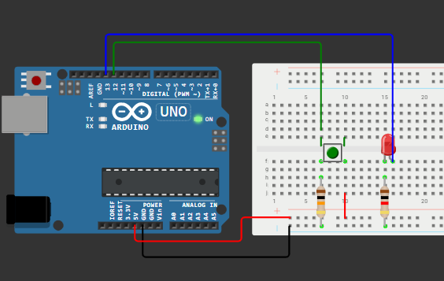

# Atividade Aula 3 — Programação Orientada a Objetos no Arduino

## Descrição

Este projeto implementa um circuito simples com **Arduino**, utilizando conceitos de **Programação Orientada a Objetos (POO)** em C++.

O circuito consiste em:
- 1 Arduino Uno  
- 1 LED  
- 1 botão  
- 2 resistores  
- Fios de conexão  

Total de 5 componentes, conforme solicitado.

## Circuito no Wokwi

Você pode visualizar e simular o circuito diretamente no Wokwi clicando no link abaixo:

**[Acessar o circuito no Wokwi](https://wokwi.com/projects/445525172110648321)**

## Funcionamento

O código faz a leitura do estado do botão e acende o LED enquanto ele estiver pressionado.  
Toda a lógica foi encapsulada em duas classes:

- `Led`: controla o estado do LED (ligar, desligar, definir estado)
- `Botao`: faz a leitura do pino do botão

## Código Principal

O código completo está no arquivo [`main.cpp`](./main.cpp).